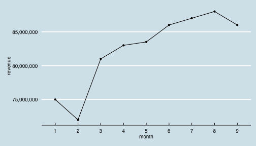

월간 매출 보고서
=======================

### SKBo 

2014년 1월부터 9월까지 매출은 다음과 같다.

<iframe src='
figure/unnamed-chunk-3.html
' scrolling='no' seamless class='rChart 
datatables
 '
id=iframe-
chartcff547a2bb53
></iframe>

월 평균 82,388,889원의 매출이 있었다.

 

