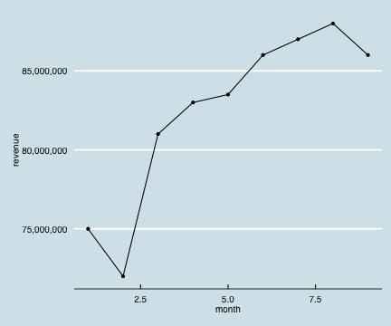

월간 매출 보고서
========================================================
author: SBKo
date: 2014년 7월

매출(표)
========================================================

2014년 1월부터 9월까지 매출은 다음과 같다.

<table>
 <thead>
  <tr>
   <th> month </th>
   <th> revenue </th>
  </tr>
 </thead>
<tbody>
  <tr>
   <td> 1 </td>
   <td> 75000000 </td>
  </tr>
  <tr>
   <td> 2 </td>
   <td> 72000000 </td>
  </tr>
  <tr>
   <td> 3 </td>
   <td> 81000000 </td>
  </tr>
  <tr>
   <td> 4 </td>
   <td> 83000000 </td>
  </tr>
  <tr>
   <td> 5 </td>
   <td> 83500000 </td>
  </tr>
  <tr>
   <td> 6 </td>
   <td> 86000000 </td>
  </tr>
  <tr>
   <td> 7 </td>
   <td> 87000000 </td>
  </tr>
  <tr>
   <td> 8 </td>
   <td> 88000000 </td>
  </tr>
  <tr>
   <td> 9 </td>
   <td> 86000000 </td>
  </tr>
</tbody>
</table>

매출(그래프)
========================================================

월 평균 82,388,889원의 매출이 있었다.

 

